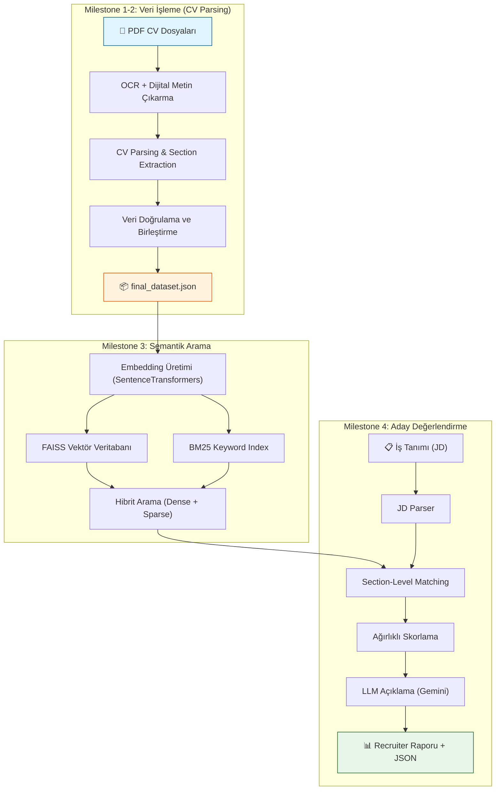

# CV Parser & Akıllı Aday Değerlendirme Sistemi - Mimari Dokümantasyon

Bu belge, PDF formatındaki CV'leri otomatik olarak işleyen, yapılandırılmış veri haline getiren, semantik arama ile iş tanımına en uygun adayları bulan ve LLM destekli açıklamalarla raporlayan uçtan uca AI sisteminin genel mimarisini ve kod işleyişini açıklamaktadır.

> [!NOTE]
> Bu proje 4 ana aşamadan (Milestone) oluşmaktadır. İlk iki aşama veriyi ham formattan anlamlı JSON formatına getirmeyi hedeflerken, son iki aşama bu veriyi kullanarak akıllı arama ve adaya özel değerlendirme yapmayı sağlar.

---

## 1. Genel Mimari ve İş Akışı

Aşağıdaki diyagram sistemin veriyi ilk aldığı andan rapor ürettiği ana kadar olan süreci göstermektedir:

---

## 2. Milestone 1 & 2: CV Veri Çıkarımı (cv_parser8.py)

Projenin en kritik ve temel bölümüdür. Düz metinleri, görselleri ve karmaşık sütun yapılarını barındıran PDF'leri alır ve yapılandırılmış JSON dosyalarına dönüştürür.

### Kullanılan Ana Fonksiyonlar:
*   **`extract_text_pdf()`**: PDF'ten dijital metni `pdfplumber` ile çıkarır. Koordinat bazlı çalıştığı için tablo ve sütunları tespit eder.
*   **`_detect_page_layout()` & `_find_column_split_x()`**: Tek sütun, iki sütun veya çok sütunlu sayfa yapılarını tespit eder ve karışıklıkları önlemek için sütunları düzgün sırayla okur.
*   **`ocr_fallback()`**: Taranmış (resim) veya bozuk karakter içeren PDF'ler tespit edildiğinde `Tesseract` çalıştırılarak metinler kurtarılır.
*   **`clean_text()`**: Özel karakter temizliği ve Türkçe karakter (`ı, İ` vb.) normalizasyonu yapar. URL'ler (GitHub, LinkedIn, Kişisel website vb.) bozulmadan korunur.
*   **`extract_sections()`**: Anahtar kelime (keyword) ve içerik tabanlı (heuristics) kontrollerle metni 10 alt bölüme ayırır (Örn: Eğitim, Deneyim, Beceriler).
*   **`group_education_blocks()` & `group_project_blocks()`**: Yanlışlıkla bölünmüş eğitim (üniversite, bölüm, yıl) veya proje alt satırlarını zekice tespit edip tek bir blok haline getirir.
*   **`validate_and_refine_extracted_fields()`**: Becerilerdeki mükerrer kayıtları temizler ve yarıda kesilmiş üniversite kelimelerini onarır.

> [!IMPORTANT]
> Son versiyonda yapılan güncellemeler sayesinde `cv_parser8.py`, kişisel web sitelerini ayıklayabilmekte, satır arası boşluklardan kaynaklanan "üniversite-bölüm" bölünmelerini otomatik onarmaktadır. Çıktı tek bir **`final_dataset.json`** dosyasıdır.

---

## 3. Milestone 3: Semantik Arama (semantic_search/)

Sistem sadece basit bir kelime araması ("SQL" yazınca "SQL" bulan) değil, anlamsal (semantic) arama yapar. "Veritabanı yönetimi" arandığında "SQL" bilen adayı bulabilir.

### Kullanılan Ana Modüller:
*   **`embeddings.py`**: JSON dosyasındaki her adayın bölümlerini (deneyim, eğitim, beceri) alır ve `SentenceTransformers` modelleri kullanarak vektör uzayına (sayısal dizilere) çevirir.
*   **`indexer.py` (FAISS)**: Üretilen vektörleri yüksek hızda aranabilir indekslere dönüştürür. Anlamsal benzerlik için Cosine Similarity baz alınır.
*   **`bm25_indexer.py` (BM25)**: Vektör aramasının zayıf kaldığı nadir "tam eşleşme" (exact keyword) durumlarını yakalamak için klasik arama motoru mantığıyla Sparse Index oluşturur.
*   **`searcher.py`**: Kullanıcıdan veya sistemden gelen arama sorgusunu alır. FAISS ve BM25 sonuçlarını birleştirerek (Hibrit Arama) en tutarlı sonuçları ağırlıklandırarak döndürür.

> [!TIP]
> FAISS anlamsal yakınlığı bulurken, BM25 nokta atışı teknik terimlerin kaybolmasını önler. Bu hibrit yapı en yüksek "Recall" ve "Precision" oranını sağlar.

---

## 4. Milestone 4: Aday Değerlendirme (candidate_ranker/)

Bu aşama, İK (HR) süreçlerini tamamen otonom hale getirmek için tasarlanmıştır. Verilen bir İş Tanımı (JD) ile sisteme kayıtlı tüm CV'leri karşılaştırır ve neden eşleştiklerini açıklar.

### Kullanılan Ana Modüller:
*   **`jd_parser.py`**: İK uzmanının verdiği metinsel iş tanımını ayrıştırır. Beklenen deneyim yılını, zorunlu becerileri, tercih edilen eğitim düzeyini ve dilleri belirler.
*   **`matcher.py` & `scorer.py`**: 
    *   İş tanımındaki her bir beklentiyi (örn: "En az 3 yıl Python deneyimi") Milestone 3'teki arama altyapısına gönderir.
    *   Adayın yetenekleri, deneyimi ve eğitimi ayrı ayrı puanlanır.
    *   Ağırlıklı bir nihai (Final) skor üretilir.
*   **`llm_explainer.py`**: Gemini 2.5 Flash modeli kullanılarak, adayın neden yüksek puan aldığı veya hangi konularda eksik olduğuyla ilgili bir insan dilinde "Recruiter Özeti" (İşe Alım Uzmanı Açıklaması) yazılır.
*   **`report_generator.py`**: Sonuçları detaylı bir JSON objesi ve kolay okunabilir bir TXT raporu olarak kaydeder (`ranking_outputs/` klasörüne).

> [!NOTE]
> Değerlendirme sistemi İngilizce ve Türkçe olarak iki dili de aynı doğruluk oranıyla destekler.

---

## 5. Klasör ve Dosya Organizasyonu

Sistemin kod dizini temiz bir modüler yapıya sahiptir:

| Klasör/Dosya | İşlev |
|--------------|-------|
| `cv-parser-script/` | Milestone 1-2 kodları. İçerisinde ana ayrıştırıcı motor olan `cv_parser8.py` bulunur. |
| `semantic_search/` | Milestone 3 kodları. Vektörleştirme ve indeksleme betikleri burada yer alır. |
| `candidate_ranker/` | Milestone 4 kodları. Değerlendirme algoritmaları ve LLM entegrasyonu buradadır. |
| `data/PDF/` | Kullanıcının sisteme yüklediği ham PDF özgeçmişlerin bulunduğu klasör. |
| `embeddings/` & `faiss_indexes/` | Vektörlerin, matematiksel uzay koordinatlarının ve indeks dosyalarının tutulduğu önbellek klasörleri. |
| `ranking_outputs/` | Oluşturulan aday değerlendirme raporlarının (`.txt` ve `.json`) kaydedildiği yer. |
| `final_dataset.json` | Tüm sistemin kalbi olan, temizlenmiş veritabanı. |
