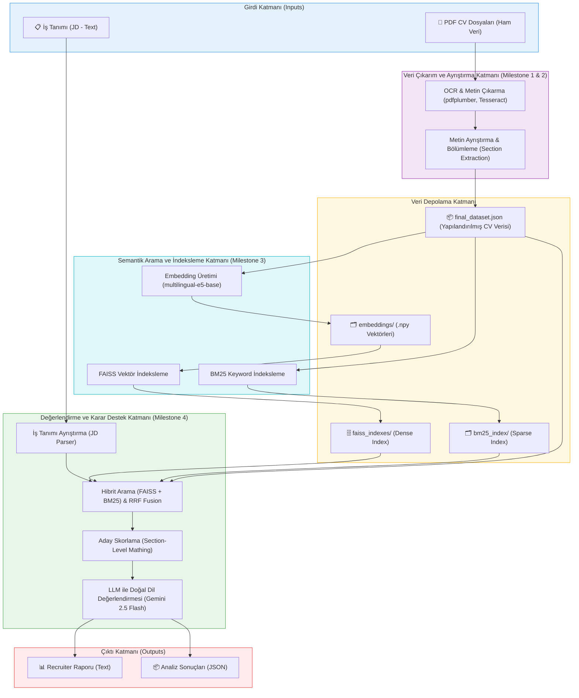

# CV Parser Project - Sistem Mimarisi ve Teknoloji Detayları

Bu belge, Akıllı CV Analiz ve Aday Değerlendirme Sistemi'nin uçtan uca genel mimarisini ve projede kullanılan teknolojilerin detaylı kullanım amaçlarını ve yerlerini açıklamaktadır.

## 1. Genel Sistem Mimarisi

Aşağıdaki diyagram, sistemin veriyi ilk aldığı andan (PDF CV'ler ve İş Tanımı), verilerin işlenmesi, indekslenmesi ve en sonunda bir sıralama ve değerlendirme raporu oluşturulmasına kadar olan uçtan uca mimariyi göstermektedir.

---

## 2. Kullanılan Teknolojiler: Ne, Neden, Nerede Kullanıldı?

Proje modüler bir yapıda 4 Milestone'dan oluşmaktadır. Kullanılan temel teknolojiler ve sistem içindeki yerleri aşağıda detaylandırılmıştır.

### 2.1 Veri İşleme ve Çıkarım Teknolojileri (Milestone 1 & 2)

**Modül Konumu:** `cv-parser-script/cv_parser8.py`

*   **pdfplumber & PyMuPDF**
    *   **Ne İçin Kullanıldı?** PDF formatındaki ham CV dosyalarından dijital (gömülü) metinleri ve sayfa layout'unu (tek sütun, çift sütun, tablo yapıları) çıkarmak için kullanıldı.
    *   **Nerede Kullanıldı?** `extract_text_pdf()` gibi fonksiyonlarda, PDF sayfalarının okunup metin bloklarının belirlenmesinde.
*   **Tesseract OCR**
    *   **Ne İçin Kullanıldı?** Taranmış (scanned) veya dijital metin okuması hatalı/bozuk olan CV sayfalarından metin elde edebilmek için "fallback" (B planı) mekanizması olarak kullanıldı. Türkçe ve İngilizce dil paketleriyle desteklendi.
    *   **Nerede Kullanıldı?** `ocr_fallback()` fonksiyonu içerisinde, pdfplumber'ın yetersiz kaldığı noktalarda.
*   **langdetect**
    *   **Ne İçin Kullanıldı?** CV içerisindeki metnin genel dilini (Türkçe veya İngilizce) otomatik tespit etmek için kullanıldı.
    *   **Nerede Kullanıldı?** CV parse edilirken, doğru keyword sözlüklerinin (skills, summary vb. başlıkları bulmak için) seçilmesi aşamasında.

### 2.2 Semantik Arama ve İndeksleme Teknolojileri (Milestone 3)

**Modül Konumu:** `semantic_search/` dizini altındaki betikler (`embeddings.py`, `indexer.py`, `bm25_indexer.py`).

*   **intfloat/multilingual-e5-base (sentence-transformers)**
    *   **Ne İçin Kullanıldı?** Metin tabanlı CV bölümlerini (deneyim, beceriler, eğitim vb.) 768 boyutlu sayısal vektörlere (embedding) dönüştürmek için kullanılmıştır. "Multilingual" olması sayesinde Türkçe ve İngilizce CV'leri aynı vektör uzayında başarılı bir şekilde temsil edebilir.
    *   **Nerede Kullanıldı?** `semantic_search/embeddings.py` içerisinde `final_dataset.json`'dan gelen bölümleri vektörize etmek için (ör: `skills_embeddings.npy` dosyalarının üretilmesi).
*   **FAISS (IndexFlatIP) (Facebook AI Similarity Search)**
    *   **Ne İçin Kullanıldı?** Oluşturulan yoğun (dense) vektörlerin hızlı bir şekilde aranması ve kosinüs benzerliğinin (Cosine Similarity = Inner Product) milisaniyeler içinde hesaplanabilmesi için vektör veritabanı altyapısı olarak kullanıldı.
    *   **Nerede Kullanıldı?** `semantic_search/indexer.py` içerisinde ve sorgu anında `semantic_search/searcher.py` dosyasında, her bir CV bölümü (skills, experience vb.) için ayrı oluşturulan indekslerde arama yaparken.
*   **BM25Okapi (rank_bm25)**
    *   **Ne İçin Kullanıldı?** Sadece anlamsal (vektörel) aramanın bazen spesifik anahtar kelimeleri kaçırmasını engellemek adına "Sparse Search" (Kelime frekansına dayalı arama) yapmak için kullanıldı. Hibrit aramanın diğer yarısını oluşturur.
    *   **Nerede Kullanıldı?** `semantic_search/bm25_indexer.py` ile indeksleme yapılırken ve arama aşamasında BM25 skorlaması elde edilirken.

### 2.3 Aday Değerlendirme ve Raporlama Teknolojileri (Milestone 4)

**Modül Konumu:** `candidate_ranker/` dizini altındaki betikler.

*   **Reciprocal Rank Fusion (RRF) Algoritması (Matematiksel Model)**
    *   **Ne İçin Kullanıldı?** FAISS'den gelen anlamsal (Dense) sıralama skoru ile BM25'ten gelen kelime tabanlı (Sparse) sıralama skorunu birleştirip (Hibrit Arama) en doğru "Top-K" aday listesini oluşturmak için kullanıldı.
    *   **Nerede Kullanıldı?** `candidate_ranker/matcher.py` veya `semantic_search/searcher.py` içerisindeki hibrit arama mantığında.
*   **Google Gemini 2.5 Flash (google-generativeai)**
    *   **Ne İçin Kullanıldı?** Sistem tarafından matematiksel olarak skorlanan ve sıralanan adaylar için, işe alım uzmanının okuyabileceği doğal dilde, anlaşılır analizler (güçlü yönler, zayıf yönler, eksik gereksinimler, öneri seviyeleri) üretmek için kullanıldı. LLM (Büyük Dil Modeli) desteği sağlar.
    *   **Nerede Kullanıldı?** `candidate_ranker/llm_explainer.py` içerisindeki `generate_llm_explanation()` fonksiyonunda. (API anahtarı bulunamadığında çalışacak kural tabanlı template fallback mekanizması ile desteklenmiştir).
*   **Python (Core + JSON/OS/RegEx)**
    *   **Ne İçin Kullanıldı?** `jd_parser.py` içerisinde İş Tanımı (Job Description) ayrıştırılırken, gerekli (required) veya tercih edilen (preferred) yetenekleri sınıflandırmak, eğitim derecelerini ve deneyim yıllarını metinden regex (düzenli ifadeler) ile ayıklamak için kullanılmıştır. Raporlamalar için de `report_generator.py` içinden text ve json çıktı üretimini sağlar.
    *   **Nerede Kullanıldı?** Projenin tüm veri akış kontrolünde (Pipeline), skorlama formüllerinde (`scorer.py` içindeki ağırlıklandırma hesapları: beceri %40, deneyim %35 vs.) ve çıktıların yazılmasında.

---
**Özetle:** 
Sistem, CV verilerini dijitalleştirip temizlemek için **PyMuPDF/pdfplumber/Tesseract** kullanır; metinleri matematiksel uzaya taşımak için **sentence-transformers (multilingual-e5-base)** modelinden faydalanır; bu vektörleri ultra hızlı aramak için **FAISS** ile **BM25** hibrit aramasını harmanlar; son karar ve yorumlama aşamasında da insansı açıklamalar için **Google Gemini 2.5 Flash** LLM'inden yararlanır.
