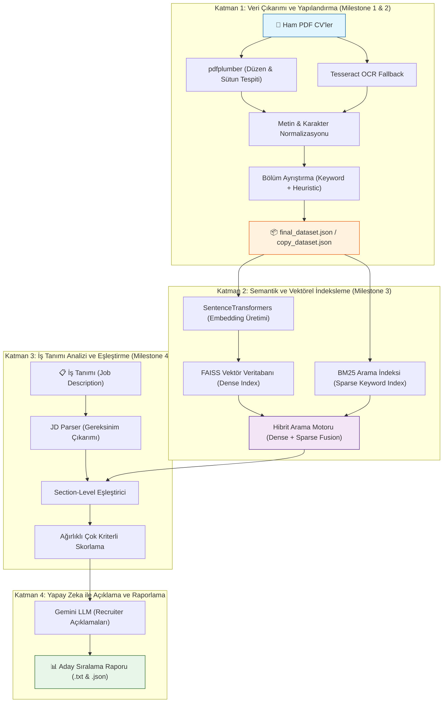

# CV Parser & Akıllı Aday Değerlendirme Sistemi — Genel Mimari ve Çalışma Prensipleri

Bu doküman; PDF formatındaki CV'lerin okunmasından, semantik vektör aramasına ve Büyük Dil Modelleri (LLM) ile aday değerlendirme raporlarının oluşturulmasına kadar uzanan **4 Aşamalı (Milestone 1-4)** uçtan uca sistem mimarisini açıklamaktadır.

---

## 1. Sistemin Uçtan Uca Mimarisi

Sistem, insan kaynakları (İK) departmanlarının iş ilanlarına en uygun adayları dakikalar içinde tespit edebilmesini sağlamak üzere 4 ana katmandan oluşmaktadır:



---

## 2. Katman Katman Sistemin Çalışma Mekanizması

### 2.1 Katman 1: CV Parsing ve Yapılandırma (`cv_parser_script/`)
* **Amaç:** Serbest metin, grafik ve farklı sayfa düzenlerine sahip PDF belgelerini standart JSON formatına dönüştürmek.
* **Çalışma Şekli:**
  1. **Sütun Analizi (Layout Detection):** `pdfplumber` ile her sayfadaki kelimelerin X-Y koordinatları çıkarılır. Sayfanın tek sütun mu yoksa iki sütun mu olduğu tespit edilir. İki sütunlu sayfalarda yatay beyaz boşluk (gap) bulunarak sütunlar doğal okuma sırasında metne dönüştürülür.
  2. **OCR Desteği:** Taranmış (resim) veya karakter kodlaması hasarlı PDF'lerde PyMuPDF ile rasterize edilen sayfalar Tesseract OCR motoruna gönderilir.
  3. **Türkçe Normalizasyonu:** Türkçe karakterlerin (`ı, İ, ş, ğ, ç, ö, ü`) bozulmasını engelleyen özel fonksiyonlar çalışır.
  4. **Bölüm Ayrıştırma:** Belge `summary`, `experience`, `education`, `skills`, `projects`, `languages`, `certificates`, `interests`, `organizations`, `other` olmak üzere 10 temel bölüme ayrılır.
  5. **Varlık Çıkarımı:** İsim, unvan, toplam deneyim yılı, e-posta, telefon, LinkedIn, GitHub ve vesikalık fotoğraf bilgileri yapılandırılır.

### 2.2 Katman 2: Semantik ve Hibrit Arama (`semantic_search/`)
* **Amaç:** Adayların özgeçmişlerini sadece birebir kelime eşleşmesiyle değil, anlamsal yakınlıklarına göre aranabilir kılmak.
* **Bileşenler:**
  * **Vektör Temsili (Dense Retrieval - FAISS):** Her CV'nin bölümleri (yetenekler, deneyim, projeler vb.) `SentenceTransformers` modeli ile 384 boyutlu vektörlere dönüştürülür ve FAISS indeksine kaydedilir. "Makine Öğrenmesi" arandığında doğrudan "Deep Learning" veya "PyTorch" geçen adaylar semantik olarak bulunur.
  * **Kelime Bazlı Arama (Sparse Retrieval - BM25):** Vektör aramalarının gözden kaçırabileceği kesin teknik kısaltmalar veya kütüphane isimleri (ör. "RK3588", "YOLOv9", "Kafka") için BM25 indeksi oluşturulur.
  * **Hibrit Füzyon (Hybrid Search):** FAISS ve BM25 skorları ağırlıklı olarak birleştirilerek hem anlamsal derinlik hem de kesin anahtar kelime hassasiyeti sağlanır.

### 2.3 Katman 3: İş Tanımı Analizi ve Skorlama (`candidate_ranker/`)
* **Amaç:** Bir pozisyona ait iş ilanını inceleyip en uygun adayları ağırlıklı formüllerle derecelendirmek.
* **Bileşenler:**
  * **JD Parser (`jd_parser.py`):** İş tanımını okur; aranan unvanı, zorunlu ve tercih edilen teknik becerileri, asgari deneyim yılını ve eğitim kriterlerini çıkarır.
  * **Section-Level Matcher (`matcher.py`):** İş tanımındaki yetenek gereksinimlerini adayın `skills` ve `projects` bölümleriyle; rol gereksinimlerini ise adayın `experience` bölümüyle ayrı ayrı semantik olarak karşılaştırır.
  * **Ağırlıklı Skorlayıcı (`scorer.py`):** Adayın nihai uygunluk puanını hesaplar:
    $$	ext{Final Skor} = w_s \cdot 	ext{Skills} + w_e \cdot 	ext{Experience} + w_{ed} \cdot 	ext{Education} + w_t \cdot 	ext{Title}$$

### 2.4 Katman 4: LLM Destekli Raporlama (`llm_explainer.py` & `report_generator.py`)
* **Amaç:** Sayısal skorların arkasındaki gerekçeleri İşe Alım Uzmanının (Recruiter) rahatça anlayabileceği doğal dilde özetlemek.
* **Bileşenler:**
  * **Gemini LLM Entegrasyonu:** Skorlanan en iyi adayların verileri Google Gemini modeline gönderilir. Model her aday için:
    * "Neden Uygun?" (Adayın güçlü yanları ve ilandaki şartlarla örtüşen projeleri)
    * "Eksik / Geliştirilebilir Alanlar" (İlanda olup adayın CV'sinde yer almayan teknolojiler)
    * "Recruiter Tavsiyesi"
    başlıklarında profesyonel bir değerlendirme notu oluşturur.
  * **Çıktı Üretimi:** Sonuçlar `ranking_outputs/` klasörüne hem detaylı JSON hem de okunabilir TXT raporu olarak kaydedilir.

---

## 3. Veri Akışı ve Dosya İlişkileri

```
[PDF CV'ler] 
      │
      ▼  (cv_parser8.py veya cv_parser8_copy.py)
[final_dataset.json / copy_dataset.json]
      │
      ├──► [embeddings/ & faiss_indexes/] (Dense Vektörler)
      ├──► [bm25_index/]                 (Sparse Anahtar Kelimeler)
      │
      ▼  (test_all_jobs.py / run_ranking.py + job_postings.json)
[candidate_ranker (JD Matcher + Scorer + Gemini LLM)]
      │
      ▼
[ranking_outputs/] (Sıralanmış Aday Listesi & İK Raporları)
```

---

## 4. Sistemin Güçlü Yönleri ve Avantajları

1. **Esnek Düzen Ayrıştırma:** Çift sütunlu ve görsel ağırlıklı şablonlarda metinlerin birbirine girmesini engeller.
2. **Kelimeden Bağımsız Anlamsal Eşleşme:** Aday "İlişkisel Veritabanı" yazmışsa ve ilanda "PostgreSQL" isteniyorsa sistem aradaki bağı kurabilir.
3. **Şeffaf ve Açıklanabilir Yapay Zeka:** Skor sadece bir sayı olarak sunulmaz; adayın neden elendiği ya da neden ilk sıraya yerleştiği madde madde gerekçelendirilir.
4. **Hızlı ve Ölçeklenebilir:** FAISS vektör indeksi sayesinde binlerce CV milisaniyeler içerisinde taranabilir.
