# CV Parser Project — Sistem Dokümantasyonu

Akıllı CV Analiz ve Aday Değerlendirme Sistemi  
Versiyon: Milestone 4 (Haziran 2026)

---

## 1. Genel Bakış

Bu proje, PDF formatındaki CV'leri otomatik olarak işleyen, yapılandırılmış veri haline getiren, semantik arama ile iş tanımına en uygun adayları bulan ve LLM destekli açıklamalarla raporlayan uçtan uca bir AI sistemidir.

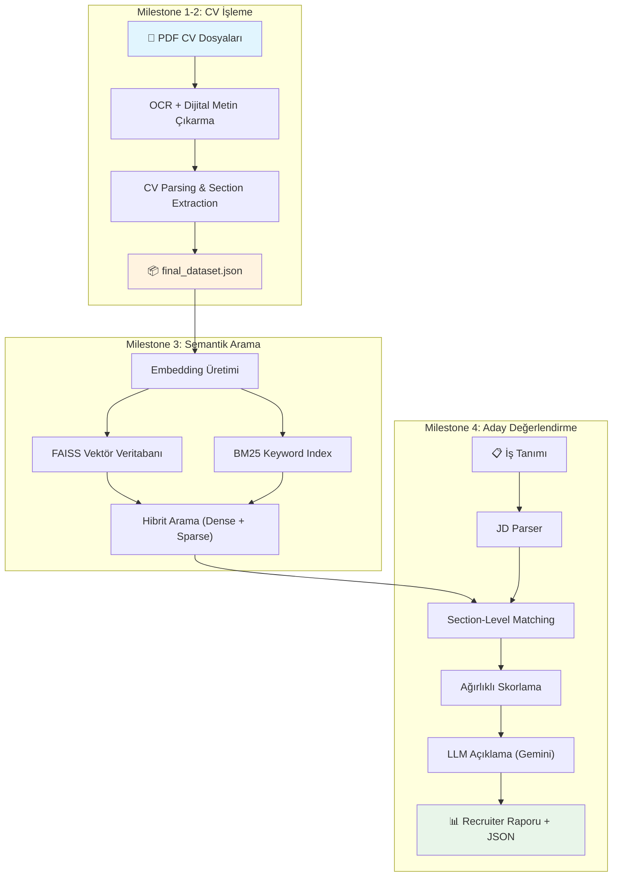

---

## 2. Proje Yapısı

```
cv_parser_project/
├── cv-parser-script/
│   └── cv_parser8.py          # Milestone 1-2: PDF parsing, OCR, section extraction
│
├── semantic_search/            # Milestone 3: Semantik arama altyapısı
│   ├── __init__.py
│   ├── config.py              # Model, path, ağırlık ayarları
│   ├── embeddings.py          # Embedding üretimi ve kaydetme
│   ├── indexer.py             # FAISS index oluşturma
│   ├── bm25_indexer.py        # BM25 keyword index
│   ├── searcher.py            # Sorgu işleme ve sıralama
│   ├── utils.py               # Dataset yükleme yardımcıları
│   ├── run_pipeline.py        # Embedding + index pipeline
│   └── run_query.py           # Arama CLI
│
├── candidate_ranker/           # Milestone 4: Aday değerlendirme sistemi
│   ├── __init__.py
│   ├── config.py              # Skorlama ağırlıkları, LLM, keyword sözlükleri
│   ├── jd_parser.py           # İş tanımı parsing (EN/TR)
│   ├── matcher.py             # Section-level benzerlik hesaplama
│   ├── scorer.py              # Ağırlıklı final skor
│   ├── llm_explainer.py       # Gemini 2.5 Flash + template fallback
│   ├── report_generator.py    # Rapor ve JSON çıktı üretimi
│   └── run_ranking.py         # Ana pipeline CLI
│
├── data/                       # Ham PDF dosyaları
│   ├── PDF/
│   └── kaggle pdf/
│
├── embeddings/                 # Kaydedilmiş embedding dosyaları (.npy)
│   ├── skills_embeddings.npy
│   ├── experience_embeddings.npy
│   ├── education_embeddings.npy
│   ├── summary_embeddings.npy
│   ├── projects_embeddings.npy
│   ├── title_embeddings.npy
│   └── resume_ids.json
│
├── faiss_indexes/              # FAISS index dosyaları
│   ├── skills_index.faiss
│   ├── experience_index.faiss
│   ├── education_index.faiss
│   ├── summary_index.faiss
│   ├── projects_index.faiss
│   └── title_index.faiss
│
├── bm25_index/                 # BM25 keyword index
│   └── bm25.pkl
│
├── ranking_outputs/            # Milestone 4 çıktıları
│   ├── JD-XXXXX_results.json
│   └── JD-XXXXX_report.txt
│
├── final_dataset.json          # İşlenmiş tüm CV'lerin yapılandırılmış verisi
└── requirements.txt            # Python bağımlılıkları
```

---

## 3. Milestone 1-2: CV İşleme Pipeline

### 3.1 Genel Akış

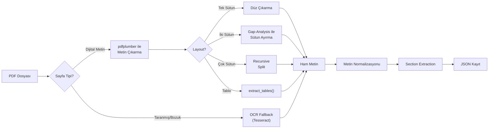

### 3.2 PDF Metin Çıkarma

| Adım | Fonksiyon | Açıklama |
|------|-----------|----------|
| 1 | `extract_text_pdf()` | pdfplumber ile dijital metin çıkarma |
| 2 | `_detect_page_layout()` | Sayfa layout tespiti (tek/çift/çok sütun/tablo) |
| 3 | `_find_column_split_x()` | Gap-analysis ile sütun sınırı bulma |
| 4 | `_extract_two_column()` | İki sütunlu sayfaları doğru sırayla okuma |
| 5 | `_is_text_broken()` | Bozuk/eksik metin tespiti |
| 6 | `ocr_fallback()` | Tesseract OCR ile fallback (TR + EN dil desteği) |

### 3.3 Metin Temizleme Pipeline

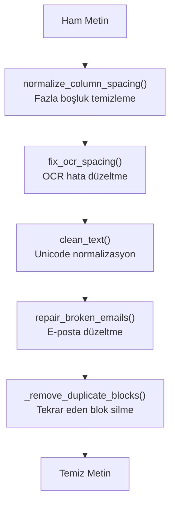

### 3.4 Section Extraction

CV metni aşağıdaki bölümlere ayrıştırılır:

| Bölüm | Alan Adı | Açıklama |
|-------|----------|----------|
| Özet | `summary` | Kişisel tanıtım, hakkımda |
| Başlık | `title` | Meslek unvanı |
| Deneyim | `experience` | İş deneyimleri |
| Eğitim | `education` | Eğitim geçmişi |
| Beceriler | `skills` | Teknik ve genel beceriler |
| Projeler | `projects` | Yapılmış projeler |
| Diller | `languages` | Bilinen yabancı diller |
| Sertifikalar | `certificates` | Alınan sertifikalar |
| İlgi Alanları | `interests` | Hobiler |
| Deneyim Yılı | `years_of_experience` | Toplam deneyim süresi |

**Extraction yöntemi:**
1. Metin bloklara ayrılır (`split_into_blocks()`)
2. Her blok için başlık tespiti yapılır (`detect_heading()`)
3. Türkçe ve İngilizce keyword eşleştirme ile section atanır (`assign_sections()`)
4. Bulunamayan bölümler içerik analizi ile sınıflandırılır (`classify_block()`)
5. Tekrar eden satırlar temizlenir (`_dedup_lines()`)
6. Her bölüme güven skoru atanır (`section_confidence`)

### 3.5 JSON Çıktı Formatı

Her CV aşağıdaki yapıda kaydedilir:

```json
{
  "resume_id": "uuid-v4",
  "file_path": "data/PDF/isim.pdf",
  "raw_text": "Tüm ham metin...",
  "sections": {
    "summary": "...",
    "title": "...",
    "experience": "...",
    "education": "...",
    "skills": "...",
    "projects": "...",
    "languages": "...",
    "certificates": "...",
    "interests": "...",
    "years_of_experience": "..."
  },
  "section_confidence": {
    "summary": 1.0,
    "skills": 0.8,
    "..."
  },
  "contact": {
    "email": "...",
    "phone": "...",
    "linkedin": "...",
    "github": "..."
  },
  "has_photo": true,
  "language": "tr",
  "source_format": "ocr"
}
```

---

## 4. Milestone 3: Semantik Arama Altyapısı

### 4.1 Genel Akış

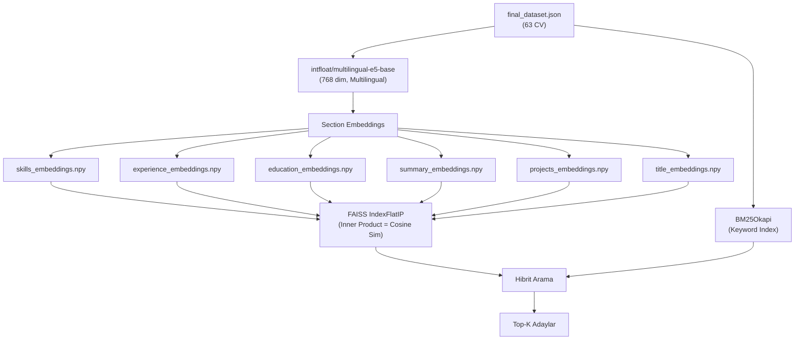

### 4.2 Embedding Modeli

| Özellik | Değer |
|---------|-------|
| Model | `intfloat/multilingual-e5-base` |
| Boyut | 768 |
| Dil Desteği | 100+ dil (Türkçe + İngilizce dahil) |
| Query Prefix | `"query: "` |
| Passage Prefix | `"passage: "` |
| Normalizasyon | L2-normalised (cosine sim = dot product) |

### 4.3 Section-Aware Arama

Her CV bölümü bağımsız olarak embed edilir ve ayrı FAISS index'lerinde saklanır. Bu sayede:
- Skills → Skills karşılaştırması
- Experience → Experience karşılaştırması
- Her bölüm ayrı ağırlıkla değerlendirilir

**Varsayılan bölüm ağırlıkları (Milestone 3):**

| Bölüm | Ağırlık |
|-------|---------|
| title | 0.15 |
| skills | 0.35 |
| experience | 0.25 |
| education | 0.05 |
| summary | 0.10 |
| projects | 0.10 |

### 4.4 Hibrit Arama (Dense + Sparse)

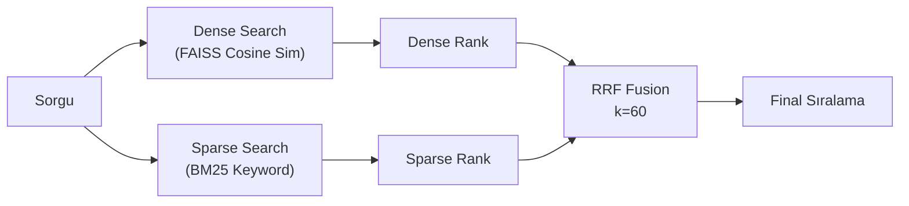

**Reciprocal Rank Fusion (RRF) formülü:**
$$RRF(d) = \frac{1}{k + rank_{dense}(d)} + \frac{1}{k + rank_{sparse}(d)}$$

Bu hibrit yaklaşım, semantik anlam (dense) ve keyword eşleşme (sparse) avantajlarını birleştirir.

### 4.5 Filtreleme Mekanizması

| Filtre | Eşik | Açıklama |
|--------|------|----------|
| Min Score | 0.79 | Bu skorun altındaki adaylar elenir |
| Max Drop | 0.02 | 1. sıradan 0.02'den fazla düşük skorlar elenir |
| Match Threshold | 0.80 | Bir bölümün "eşleşti" sayılması için minimum sim |

### 4.6 Pipeline Çalıştırma

```bash
# Index oluşturma (ilk seferde)
python -m semantic_search.run_pipeline

# Arama yapma
python -m semantic_search.run_query --query "Python developer with ML experience"
```

---

## 5. Milestone 4: Aday Değerlendirme ve Karar Destek Sistemi

### 5.1 Genel Akış

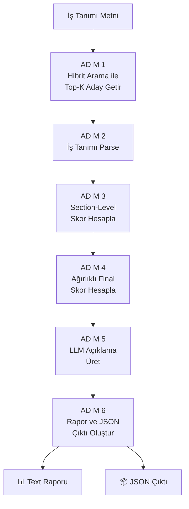

### 5.2 Adım 1 — İş Tanımı Parsing

`jd_parser.py` → `parse_job_description()`

Ham iş tanımı metninden yapılandırılmış alanlar çıkarır:

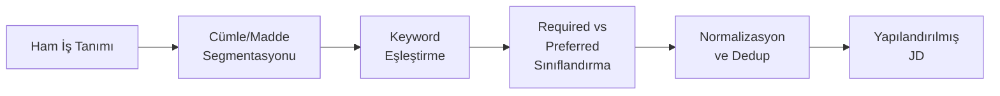

**Çıktı yapısı:**
```json
{
  "required_skills":      ["python", "machine learning"],
  "preferred_skills":     ["docker"],
  "required_experience":  ["3+ years"],
  "education_requirements": [{"level": "bachelor", "field": "computer engineering"}],
  "soft_skills":          ["communication", "teamwork"]
}
```

**Desteklenen extraction yöntemleri:**

| Kategori | Yöntem | Örnek (EN) | Örnek (TR) |
|----------|--------|------------|------------|
| Teknik Beceri | Keyword sözlük eşleşme (200+ terim) | Python, TensorFlow | AutoCAD, SAP2000 |
| Soft Skill | Bilingual keyword eşleşme | Communication | İletişim |
| Eğitim Seviyesi | Degree level mapping | Bachelor's, MSc | Lisans, Yüksek Lisans |
| Eğitim Alanı | Alan adı eşleşme | Computer Science | Bilgisayar Mühendisliği |
| Deneyim | Regex pattern matching | 3+ years experience | En az 5 yıl deneyim |
| Required/Preferred | Sinyal kelime tespiti | "must have" | "gerekli", "tercih edilir" |

### 5.3 Adım 2 — Section-Level Matching

`matcher.py` → `calculate_section_similarity()`

Her aday için 4 ayrı bölüm skoru hesaplanır:

```mermaid
graph TD
    subgraph "Skills Score"
        JS["JD: required_skills +\npreferred_skills"] --> ES1["Embed\n(query:)"]
        CS["CV: sections.skills"] --> EP1["Embed\n(passage:)"]
        ES1 --> COS1["Cosine\nSimilarity"]
        EP1 --> COS1
        COS1 --> SS["skills_score\n(0-100)"]
    end
    
    subgraph "Experience Score"
        JE["JD: required_experience +\nskills context"] --> ES2["Embed"]
        CE["CV: experience +\nprojects"] --> EP2["Embed"]
        ES2 --> COS2["Cosine\nSimilarity"]
        EP2 --> COS2
        COS2 --> XS["experience_score\n(0-100)"]
    end
    
    subgraph "Education Score"
        JED["JD: education_requirements"] --> DEG["Degree Level\nKeyword Match"]
        CED["CV: education"] --> DEG
        JED --> FLD["Field of Study\nEmbedding Sim"]
        CED --> FLD
        DEG --> EDUS["50% Level +\n50% Field"]
        FLD --> EDUS
        EDUS --> EDS["education_score\n(0-100)"]
    end
    
    subgraph "Soft Skill Score"
        JSS["JD: soft_skills"] --> ES4["Embed"]
        CSS["CV: summary +\nexperience"] --> EP4["Embed"]
        ES4 --> COS4["Cosine\nSimilarity"]
        EP4 --> COS4
        COS4 --> SFS["soft_skill_score\n(0-100)"]
    end
```

**Skor hesaplama detayı:**
1. Her JD gereksinim terimi ayrı ayrı embed edilir (`query:` prefix)
2. İlgili CV bölümü embed edilir (`passage:` prefix)
3. Her JD terimi ile CV bölümü arasında cosine similarity hesaplanır
4. Tüm terimlerin ortalaması alınır
5. Ham similarity [0.3, 1.0] aralığından [0, 100] ölçeğine map edilir

**Eğitim skoru özel mantığı:**

| Durum | Skor |
|-------|------|
| Aday seviyesi >= gereken seviye | 100 |
| Aday seviyesi < gereken seviye | 40 |
| Eğitim seviyesi tespit edilemedi | 20 |
| JD'de eğitim gereksinimi yok | 60 (nötr) |

### 5.4 Adım 3 — Ağırlıklı Final Skor

`scorer.py` → `calculate_final_score()`

```
final_score = (skills_score     x 0.40)
            + (experience_score x 0.35)
            + (education_score  x 0.15)
            + (soft_skill_score x 0.10)
```

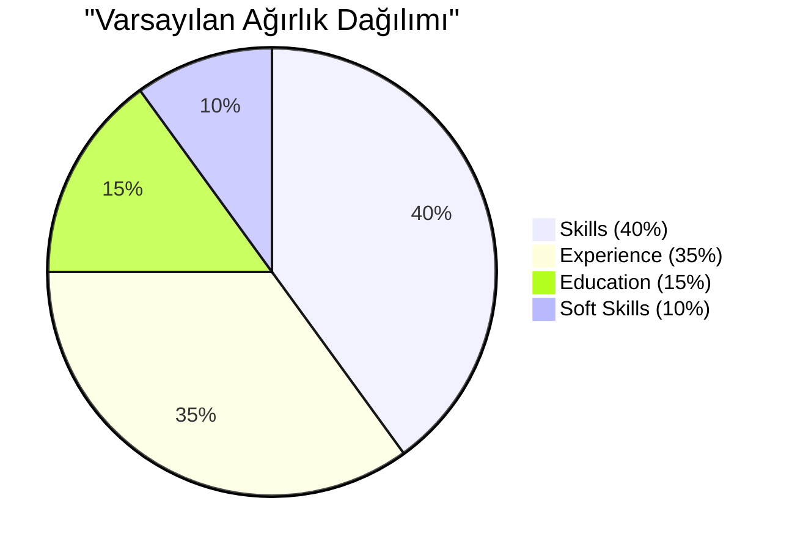

**Ağırlıklar CLI'dan özelleştirilebilir:**
```bash
python -m candidate_ranker.run_ranking \
    --jd "..." \
    --weight-skills 0.50 \
    --weight-experience 0.30 \
    --weight-education 0.10 \
    --weight-soft-skill 0.10
```

### 5.5 Adım 4 — LLM Açıklama

`llm_explainer.py` → `generate_llm_explanation()`

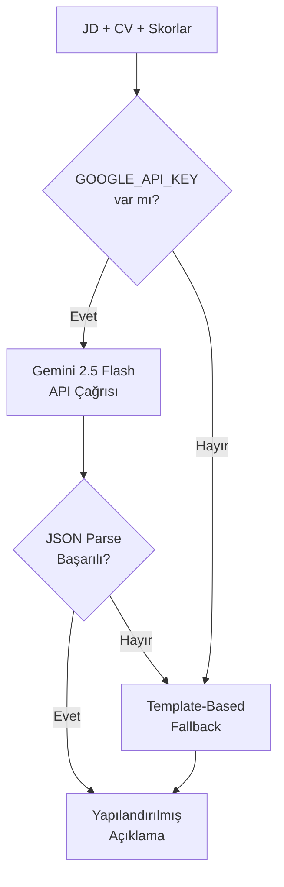

**LLM çıktı yapısı:**
```json
{
  "candidate_id": "uuid",
  "llm_score": 89,
  "strengths": [
    "Strong Python experience",
    "Relevant ML projects"
  ],
  "weaknesses": [
    "Limited cloud experience"
  ],
  "missing_requirements": [
    "Docker",
    "Kubernetes"
  ],
  "recommendation": "Strong Match"
}
```

**Recommendation seviyeleri:**

| Skor Aralığı | Recommendation |
|--------------|----------------|
| 85-100 | Strong Match |
| 70-84 | Good Match |
| 55-69 | Moderate Match |
| 40-54 | Weak Match |
| 0-39 | Not Recommended |

**Template-based fallback mantığı:**
- API key yoksa veya LLM çağrısı başarısız olursa otomatik devreye girer
- Section skorlarından kural tabanlı strengths/weaknesses üretir
- CV skills metninde JD gereksinimlerini arar, bulunmayanları `missing_requirements` olarak raporlar

### 5.6 Adım 5 — Rapor Üretimi

`report_generator.py` → `generate_candidate_report()`

İki çıktı dosyası üretilir:

**1. Text Rapor** (`JD-XXXXX_report.txt`):
```
================================================================================
  CANDIDATE RANKING REPORT
================================================================================
  Job ID     : JD-d669d0d5
  Date       : 2026-06-22 22:27
  Candidates : 5

  Job Description:
  Python developer with machine learning and data analysis experience

--------------------------------------------------------------------------------
  Rank  Candidate ID                      Skills   Exp    Edu    Soft   Total
  --------------------------------------------------------------------------
  1     f28bb141-c3fa-...                   75.0   78.9   60.0   60.0   72.6
  2     018ef800-076c-...                   76.9   75.4   60.0   60.0   72.2
--------------------------------------------------------------------------------

  CANDIDATE #1 - f28bb141-c3fa-...
  Final Score: 72.6/100
  Recommendation: Good Match

  [+] Strengths:
    - Strong technical skill alignment (score: 75)
    - Relevant professional experience (score: 79)

  [!] Missing Requirements:
    - machine learning
    - data analysis
================================================================================
```

**2. JSON Çıktı** (`JD-XXXXX_results.json`):
```json
{
  "job_id": "JD-d669d0d5",
  "job_description": "...",
  "parsed_jd": { ... },
  "timestamp": "2026-06-22T22:27:29",
  "total_candidates_evaluated": 5,
  "scoring_weights": { ... },
  "top_candidates": [
    {
      "rank": 1,
      "candidate_id": "...",
      "final_score": 72.6,
      "section_scores": {
        "skills_score": 75.0,
        "experience_score": 78.9,
        "education_score": 60.0,
        "soft_skill_score": 60.0
      },
      "llm_explanation": {
        "candidate_id": "...",
        "llm_score": 73,
        "strengths": [...],
        "weaknesses": [...],
        "missing_requirements": [...],
        "recommendation": "Good Match"
      }
    }
  ]
}
```

---

## 6. Uçtan Uca Sistem Akışı

Tüm milestone'ların birlikte çalışma şeması:

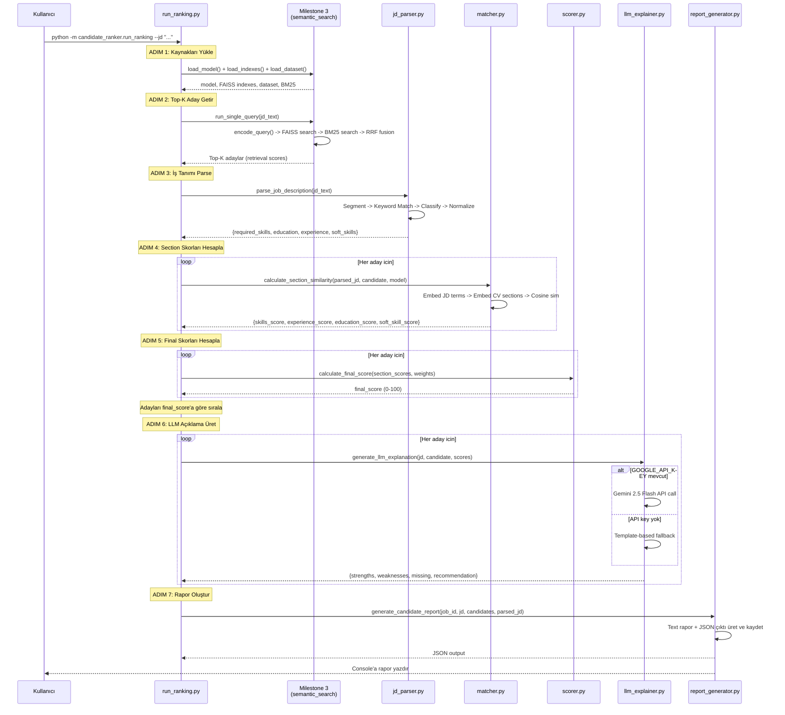

---

## 7. Kullanım Kılavuzu

### 7.1 İlk Kurulum

```bash
# Bağımlılıkları yükle
pip install -r requirements.txt

# Embedding ve FAISS index'lerini oluştur (ilk seferde)
python -m semantic_search.run_pipeline
```

### 7.2 Aday Sıralama

```bash
# Temel kullanım
python -m candidate_ranker.run_ranking --jd "Python developer with ML experience"

# Türkçe iş tanımı
python -m candidate_ranker.run_ranking --jd "AutoCAD bilen insaat muhendisi"

# Özel top-k sayısı
python -m candidate_ranker.run_ranking --jd "..." --top-k 10

# Özel ağırlıklar
python -m candidate_ranker.run_ranking --jd "..." --weight-skills 0.50

# Sadece JSON çıktı
python -m candidate_ranker.run_ranking --jd "..." --json

# LLM olmadan (template-only)
python -m candidate_ranker.run_ranking --jd "..." --skip-llm
```

### 7.3 LLM Entegrasyonu (Opsiyonel)

```powershell
# Gemini API key ayarla (PowerShell)
$env:GOOGLE_API_KEY = "AIzaSy..."

# Artık LLM açıklamaları otomatik aktif
python -m candidate_ranker.run_ranking --jd "..."
```

### 7.4 Sadece Semantik Arama (Milestone 3)

```bash
# Tek sorgu
python -m semantic_search.run_query --query "Data scientist"

# Örnek sorgularla test
python -m semantic_search.run_query

# JSON çıktı
python -m semantic_search.run_query --query "..." --json
```

---

## 8. Teknoloji Yığını

| Bileşen | Teknoloji | Versiyon |
|---------|-----------|---------|
| Embedding Model | intfloat/multilingual-e5-base | sentence-transformers >= 2.2.0 |
| Vektör Veritabanı | FAISS (IndexFlatIP) | faiss-cpu >= 1.7.0 |
| Keyword Arama | BM25Okapi | rank_bm25 >= 0.2.2 |
| LLM | Google Gemini 2.5 Flash | google-generativeai >= 0.5.0 |
| PDF İşleme | pdfplumber + PyMuPDF | - |
| OCR | Tesseract | - |
| Dil Tespiti | langdetect | - |
| Python | 3.10+ | - |

---

## 9. Veri Akış Diyagramı

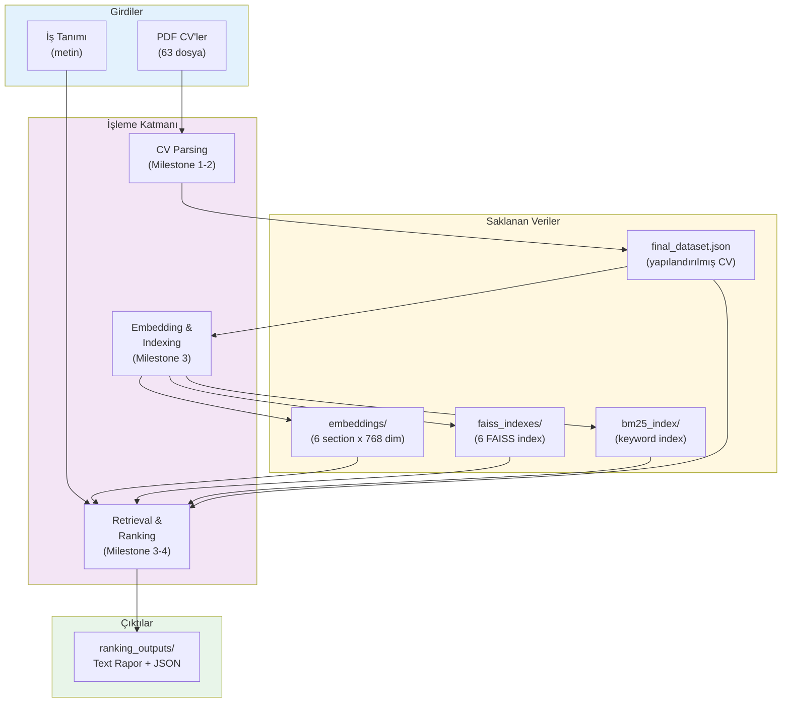

---

## 10. Önemli Tasarım Kararları

| Karar | Neden |
|-------|-------|
| Section-aware embedding | Her CV bölümünü ayrı embed etmek, genel bir embedding'e göre daha hassas eşleşme sağlar |
| Hibrit arama (Dense + BM25) | Semantik anlam + keyword eşleşme birlikte daha güçlü sonuç verir |
| LLM sadece scoring sonrası | LLM pahalı ve yavaş; önce deterministik scoring ile eleme, sonra LLM ile açıklama |
| Template fallback | API key olmadan da tam fonksiyonel çalışma garantisi |
| Bilingual sözlükler | Türkçe ve İngilizce CV/JD desteği tek sözlükle |
| Configurable ağırlıklar | Farklı iş pozisyonları için ağırlık ayarlanabilir |
| Milestone izolasyonu | Her milestone kendi paketi; Milestone 3 kodu Milestone 4'ten etkilenmez |
